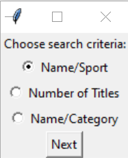
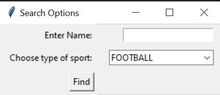
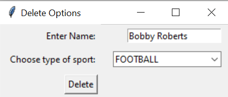
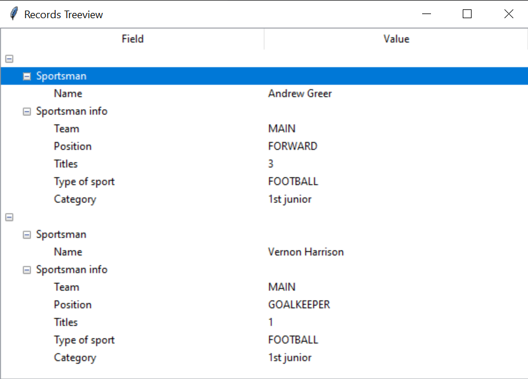

## Лабораторная работа №2

### Вариант: 7

### Цель:
- Изучить принципы построения графического пользовательского интерфейса
- Разработать программную систему с графическим пользовательским интерфейсом на языке Python
### Задача: 
Разработать оконное приложение с одним главным окном и несколькими дочерними диалогами. Вызов диалогов осуществляется через соответствующие пункты меню. Команды меню должны дублироваться на панели инструментов. 

### Демонстрация разработанной системы:
#### Главное окно:

На главном окне есть панель инструментов, содержащая все кнопки, так и меню, в котором данные кнопки дублируются. Вывод записей осуществляется с лимитом, который по умолчанию равен 10 и может быть задан пользователем. Помимо этого отображается кол-во всех записей и кол-во страниц, которое зависит от лимита.

#### Окно добавления записи:
  
В окне добавления записей пользователь заполняет не все поля, т.к некоторые из них предлагаются ему на выбор в виде выпадающего списка.
#### Окно поиска записи:

В окне поиска пользователю доступно 3 вида поиска. Вывод записей также осуществляется постранично, с возможностью перемещатся по ним.
#### Окно удаления записей:

В окне удаления также, как и в окне поиска, удаление доступно по нескольким параметрам. После нажатия на кнопку "Удалить" пользователю будет сообщено, сколько записей было удалено.
#### Окно вывода информации в виде дерева:

В данном окне информация выводится в виде дерева.

Помимо этого есть кнопки, отвечающие за загрузку и выгрузку информации из бд(PostgreSQL) и из xml-файла(Предлагается пользователю на выбор).
### Вывод:
При написании данной лабораторной работы я ознакомился с библиотекой Tkinter для создания пользовательских интерфейсов (GUI).